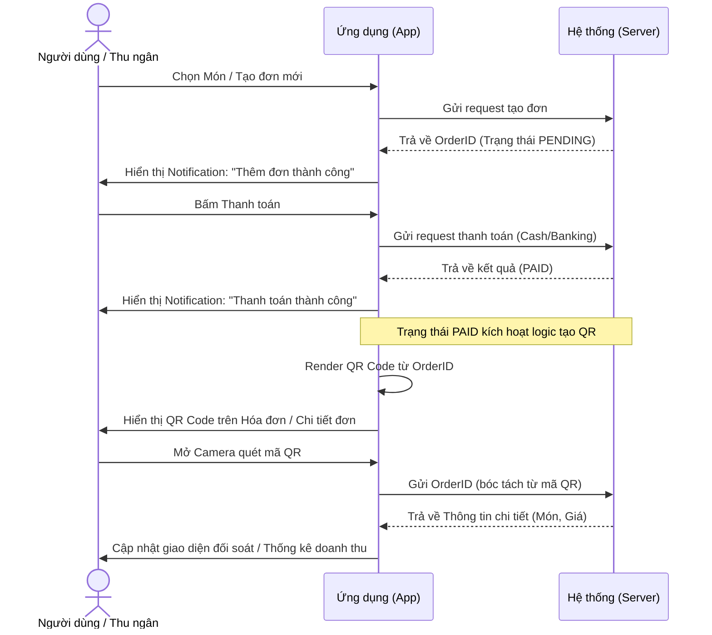

# Đánh giá Thiết kế (Review): UI Notification & Quản lý đơn bằng QR Code

## 1. Tổng quan yêu cầu & Đánh giá
Tính năng nhằm tối ưu hóa trải nghiệm người dùng bằng cách cung cấp phản hồi hình ảnh/âm thanh (Toast Notifications) ngay sau khi thao tác. Quan trọng hơn, việc chuyển đổi đơn hàng vật lý sang QR Code giúp thu ngân/quản lý tiết kiệm thời gian đối soát, tra cứu và tổng hợp doanh thu nhanh chóng.

## 2. Đánh giá Thư viện & Công nghệ
- **UI Notifications**: Tận dụng `react-native-toast-message` là giải pháp an toàn, hiệu năng cao, và không can thiệp sâu vào Native code. Có thể cấu hình custom view để đẹp và mang tính thương hiệu (Native Coffee / Bill Chips).
- **Phát sinh mã QR (QR Generation)**: Cần thêm `react-native-qrcode-svg`. Render bằng SVG trên Mobile rất sắc nét, dung lượng nhỏ, không bị vỡ hạt như dùng canvas bitmap.
- **Quét mã QR (QR Scanner)**: Thư viện `react-native-camera-kit` đã có trong `package.json`, đủ khả năng quét nhanh. Cần chú ý quyền truy cập (Permissions) cho iOS và Android.

## 3. Sơ đồ tương tác nghiệp vụ (Sequence Diagram)

## 4. Rủi ro & Điểm cần lưu ý (Risks & Mitigations)
- **Kích thước mã QR**: Đảm bảo payload sinh QR chỉ chứa chuỗi ID hoặc JSON rất ngắn để mã QR ít điểm ảnh (ít rối), giúp camera quét xa/nhanh hơn.
- **Kiểm soát luồng (Flow Control)**: Không hiển thị QR cho các đơn "Nháp" hoặc "Chờ thanh toán" để tránh quét nhầm dẫn đến lỗi tính sai doanh thu.
- **Quyền Camera**: Cần xử lý UI fallback (báo lỗi) khéo léo khi người dùng từ chối cấp quyền Camera.
