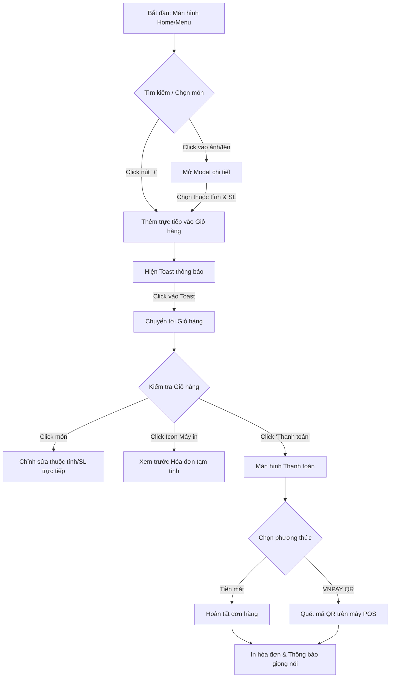
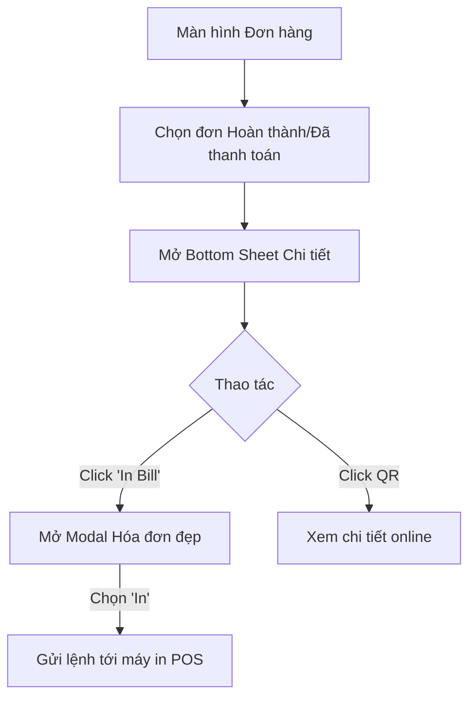
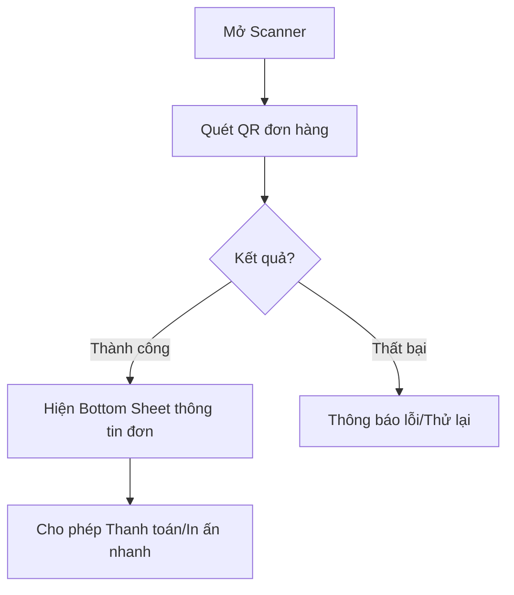

# Chips Bill POS - Quy trình hệ thống (Review)

Tài liệu này tổng hợp các luồng xử lý chính của ứng dụng Chips Bill đã được tối ưu hóa cho thiết bị POS.

## 1. Luồng Bán hàng (Sales Flow)
Luồng này tập trung vào tốc độ nhập liệu và tính linh hoạt khi chỉnh sửa món.

## 2. Luồng Quản lý Đơn hàng & In ấn (Order Management & Print Flow)
Luồng xử lý đơn đã hoàn thành và in lại hóa đơn.

## 3. Luồng Quét mã QR (Scan QR Flow)

## 4. Các điểm tối ưu kỹ thuật
- **UI Compact**: Giảm padding/margin tối đa cho màn hình POS.
- **Direct-to-Cart**: Bỏ qua bước modal trung gian khi không cần chọn thuộc tính.
- **In-place Edit**: Update item trong giỏ hàng thông qua `cartId` duy nhất.
- **Receipt Preview**: Sử dụng `ReceiptModal` chung cho toàn ứng dụng để đảm bảo tính nhất quán.
