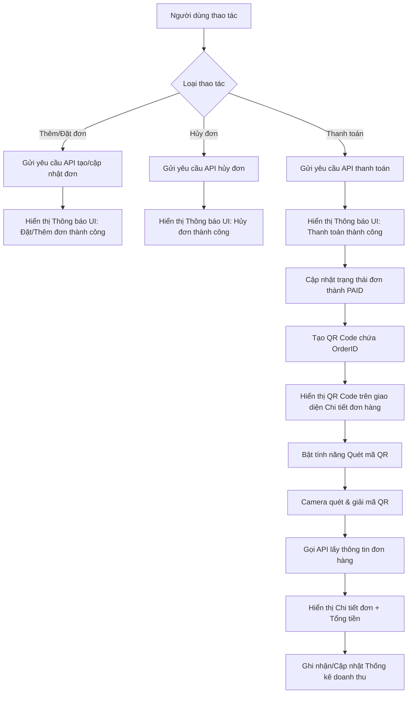

# Kế hoạch phát triển chức năng UI, Thông báo và Quản lý QR Code cho Đơn hàng

## 1. Mục tiêu
- **Làm đẹp UI:** Tinh chỉnh, thiết kế giao diện cao cấp và chuyên nghiệp hơn.
- **Hệ thống Thông báo (Notification):** Bắn thông báo UI (Toast) mượt mà cho các sự kiện: Thêm đơn hàng, Thanh toán thành công, Đặt đơn mới, Hủy đơn.
- **Quản lý đơn hàng (QR Code):** Sau khi đơn hàng chuyển sang trạng thái "Thanh toán thành công" (PAID), tự động sinh 1 mã QR đại diện cho đơn hàng đó.
- **Quét mã QR (Scan QR):** Hỗ trợ dùng camera quét mã QR của đơn hàng, tự động truy xuất và hiển thị thông tin chi tiết (món, tổng tiền). Dùng dữ liệu này để theo dõi đơn và thống kê doanh thu.

## 2. Sơ đồ luồng xử lý chi tiết (Flowchart)

## 3. Các công việc cần thực hiện (Tasks)

1. **Chuẩn bị Thư viện:**
   - Cài đặt `react-native-qrcode-svg` để render mã QR chất lượng cao.
   - Đảm bảo `react-native-camera-kit` (đã có) và cấp quyền camera thành công.

2. **Xây dựng module Thông báo (UI Notification):**
   - Sử dụng `react-native-toast-message` để chuẩn hóa các giao diện thông báo.
   - Tích hợp logic Toast vào: `OrderScreen`, `CheckoutScreen`, `PaymentScreen`.

3. **Sinh QR Code trong Quản lý Đơn hàng:**
   - Trong `OrderScreen` (hoặc `OrderBottomSheet`), thêm khối hiển thị QR Code nếu `status === 'PAID'` hoặc `status === 'DONE'`.
   - Payload của mã QR có thể là chuỗi định dạng: `{"orderId": "..."}`.

4. **Trang Quét QR Code (Scanner) & Thống kê:**
   - Xây dựng component/screen riêng cho Camera Scanner.
   - Bắt sự kiện quét thành công `onReadCode`.
   - Hiển thị pop-up hoặc chuyển hướng sang trang chi tiết, hiển thị doanh thu cụ thể của đơn vừa quét.
